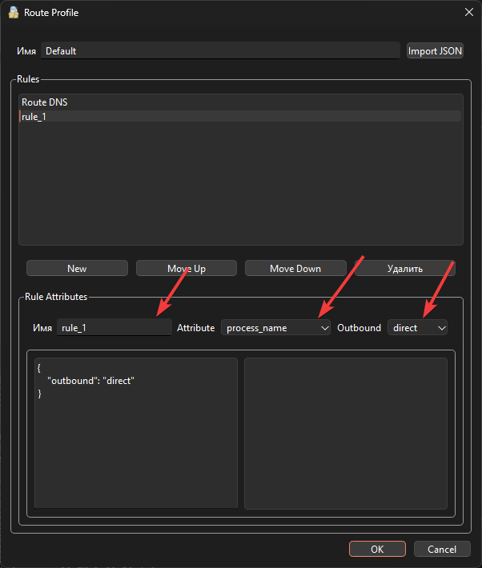
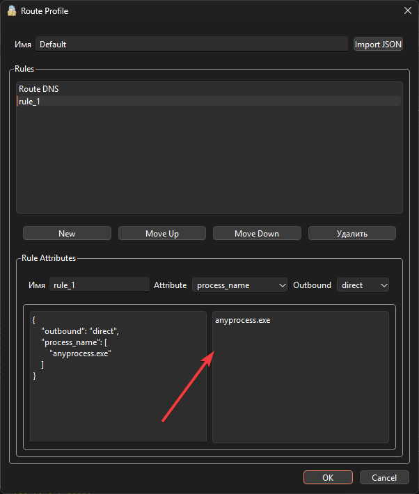
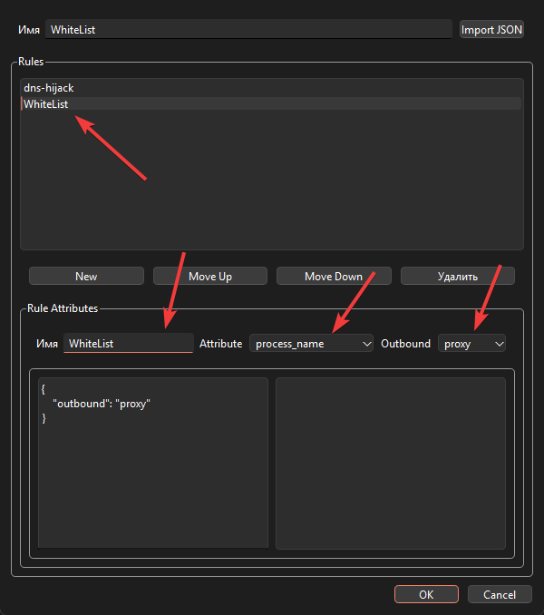
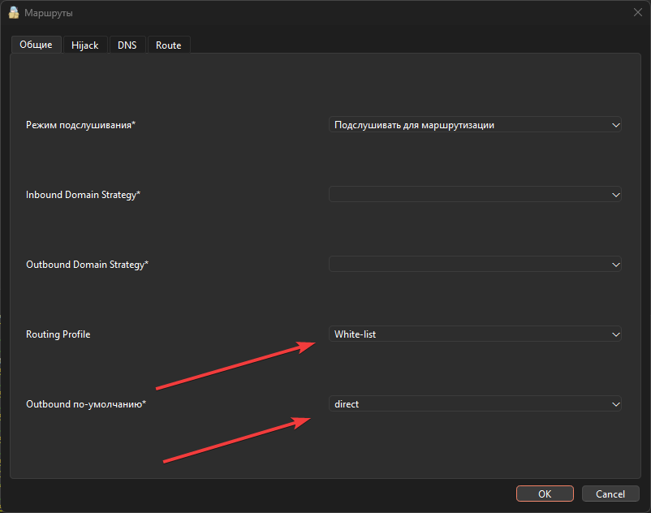

# Nekoray

??? Sources
    [Aéza](https://wiki.aeza.net/universal-virtual-private-network-client-nekoray#pervichnaya-nastroika-nekoray-na-windows)

Before we begin, note that there are two installation options depending on your needs:

- If you chose [Reality](https://wiki.amdcloud.kz/3x-ui/#reality) method for your 3x-ui installation - you may use the original [Nekoray](https://github.com/MatsuriDayo/nekoray).
- If you need to proxy specific applications, we recommend [Mahdi-zarei's nekoray fork](https://github.com/Mahdi-zarei/nekoray).

This is because no matter what version of an original [Nekoray](https://github.com/MatsuriDayo/nekoray), the "Whitelist Mode" in Tun Mode settings does not work for everyone in our team. As a result, you won’t be able to proxy only specific applications.

## Install 

Installing and Configuring Nekoray

Here is a list of all available download links for Nekoray, categorized by operating system:

- **Nekoray for Windows (64-bit)**
=== "Mahdi-zarei's fork"
    [Download Mahdi-zarei's fork](https://github.com/Mahdi-zarei/nekoray/releases/latest)
=== "3.26"
    [Download 3.26](https://github.com/MatsuriDayo/nekoray/releases/download/3.26/nekoray-3.26-2023-12-09-windows64.zip)
=== "3.25"
    [Download 3.25](https://github.com/MatsuriDayo/nekoray/releases/download/3.25/nekoray-3.25-2023-11-25-windows64.zip)

- **Nekoray for linux (64-bit, archive)**
=== "Mahdi-zarei's fork"
    [Download Mahdi-zarei's fork](https://github.com/Mahdi-zarei/nekoray/releases/latest)
=== "3.26"
    [Download 3.26](https://github.com/MatsuriDayo/nekoray/releases/download/3.26/nekoray-3.26-2023-12-09-linux64.zip)
=== "3.25"
    [Download 3.25](https://github.com/MatsuriDayo/nekoray/releases/download/3.25/nekoray-3.25-2023-11-25-linux64.zip)

- **Nekoray for Linux (AppImage)**
=== "Mahdi-zarei's fork"
    [Download Mahdi-zarei's fork](https://github.com/Mahdi-zarei/nekoray/releases/latest)
=== "3.26"
    [Download 3.26](https://github.com/MatsuriDayo/nekoray/releases/download/3.26/nekoray-3.26-2023-12-09-linux-x64.AppImage)
=== "3.25"
    [Download 3.25](https://github.com/MatsuriDayo/nekoray/releases/download/3.25/nekoray-3.25-2023-11-25-linux-x64.AppImage)  

- **Nekoray for Debian/Ubuntu (64-bit, package .deb)**
=== "Mahdi-zarei's fork"
    [Download Mahdi-zarei's fork](https://github.com/Mahdi-zarei/nekoray/releases/latest)
=== "3.26"
    [Download 3.26](https://github.com/MatsuriDayo/nekoray/releases/download/3.26/nekoray-3.26-2023-12-09-debian-x64.deb)
=== "3.25"
    [Download 3.25](https://github.com/MatsuriDayo/nekoray/releases/download/3.25/nekoray-3.25-2023-11-25-debian-x64.deb) 

- **Nekoray for Android**
=== "arm64-v8a"
    [Download Latest for arm64-v8a](https://github.com/MatsuriDayo/NekoBoxForAndroid/releases/latest)
=== "armeabi-v7a"
    [Download Latest for armeabi-v7a](https://github.com/MatsuriDayo/NekoBoxForAndroid/releases/latest)

## Installing Nekoray on Windows

Next, we will look at the installation process for Nekoray on Windows. Some steps may vary depending on the system, but the overall process remains the same.

Step 1: Download `Nekoray`

Step 2: fter the download is complete, follow these steps:

- Locate the downloaded file: `nekoray-3.26-2023-12-09-windows64.zip`.  

- Right-click on the file and select "Extract All…", or use an archiving tool like WinRAR or 7-Zip to extract the contents to a convenient location on your computer.  

Step 3: Launching the Program

1. Open the folder with the extracted files.
2. Locate the file `nekoray.exe`.
3. Double-click it to launch the program.

The program works out of the box. No installation is required.

## Initial Setup of original Nekoray

1. Core Selection:

When you launch the program for the first time, make sure to select the **sing-box** core. 

This is necessary for proper functionality.
If you were not given this choice or selected something other than sing-box, you can check or change it in the settings:

- Click on **Settings**
- General **Settings**
- Navigate to the **Core** tab
- Select `sing-box`.

2. Adding a Profile

1. Copy the profile link for the VPN connection.
2. Paste it into Nekoray using the shortcut Ctrl + V or through the menu:  
- Click on the **Server** button.  
- Select the option **Add Profile from Clipboard**.

Now we have three scenarios:

1. If you only need to proxy the browser. This works for **any version**.

2. If you need everything to be proxied, select "TUN Mode". We’ll go into more detail about configuring this below. This is **only relevant** for version **3.26** or older.

### Scenario 1

**System Proxy mode**

- Right-click on the **profile**.
- Select **Start**.
- At the top, you will see **System Proxy Mode** — *turn it on*.

**Done.**

### Scenario 2

**For 3.26 version**

1. Go to the Settings tab.
2. Open **TUN Mode** Settings.
3. Configure the following:  
- Stack: **Mixed**  
- MTU: **1500** (*you can leave it at 9000, but we recommend 1500*).  
- Mode **TUN**: Turn off.  
*although in original versions of nekoray, whitelist/blocklist doesn’t work at all*   

**Next:**

- Right-click on the **profile**.
- Select **Start**.
- At the top, you will see **TUN Mode** — turn it on. You will be prompted to restart the program as **an administrator**. **Confirm**.

## Initial Setup of Nekoray fork

### Blocklist

Go to Settings -> Route Settings -> Route 

Select `Default` and click `Edit`

Click `New` and rename new Rules

In the **Name** field, you can enter any name you want. In the **Attribute** field, select `process_name`. In **Outbound**, choose `direct`.

In the bottom left field, enter the process you do not want to proxy. Process names can be found in the Task Manager under the Details tab.

!!! warning
    It is important to enter the process name with the correct letter case. If the process starts with an uppercase letter but you enter it in lowercase (or vice versa), it will not work.

## Whitelist

Go to Settings -> Route Settings -> Route

Click `New`, write name for your new Route in field **Name**

Add **new** Rule. Select **Attribute** -> `process_name` and **Outbound** -> `proxy`

 

In the left field, enter the processes you want to proxy.

!!! warning
    It is important to enter the process name with the correct letter case. If the process starts with an uppercase letter but you enter it in lowercase (or vice versa), it will not work.

Save the settings, and then in the route settings, under **General**, select our profile in **Routing Profile**, and set **Outbound** to `direct`.

